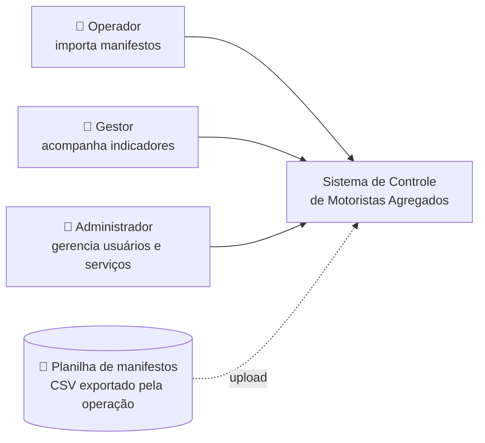
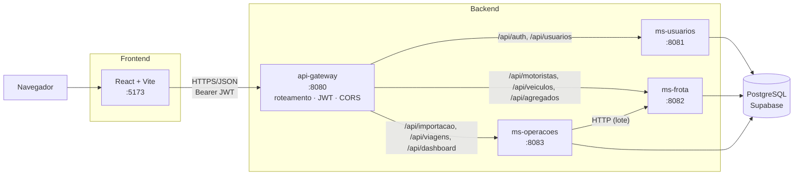
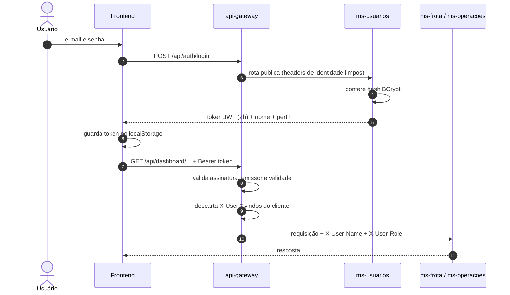
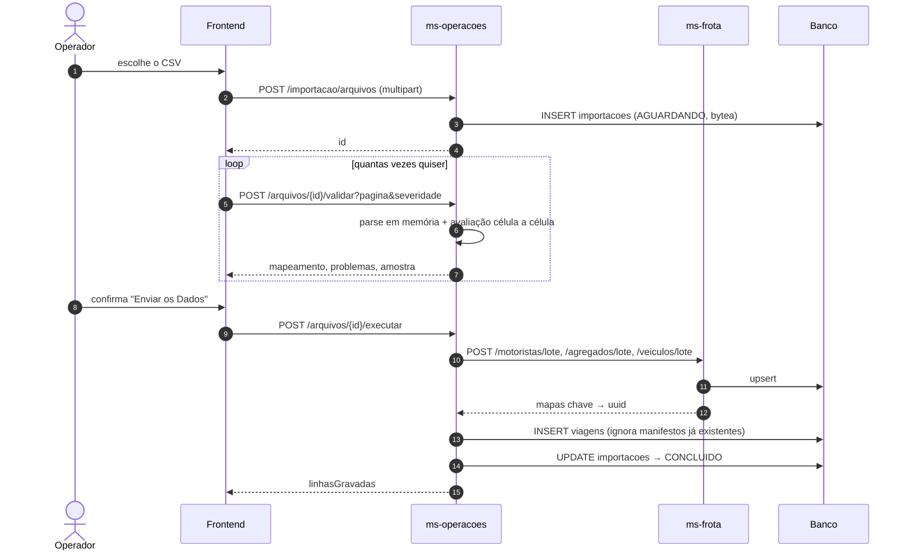
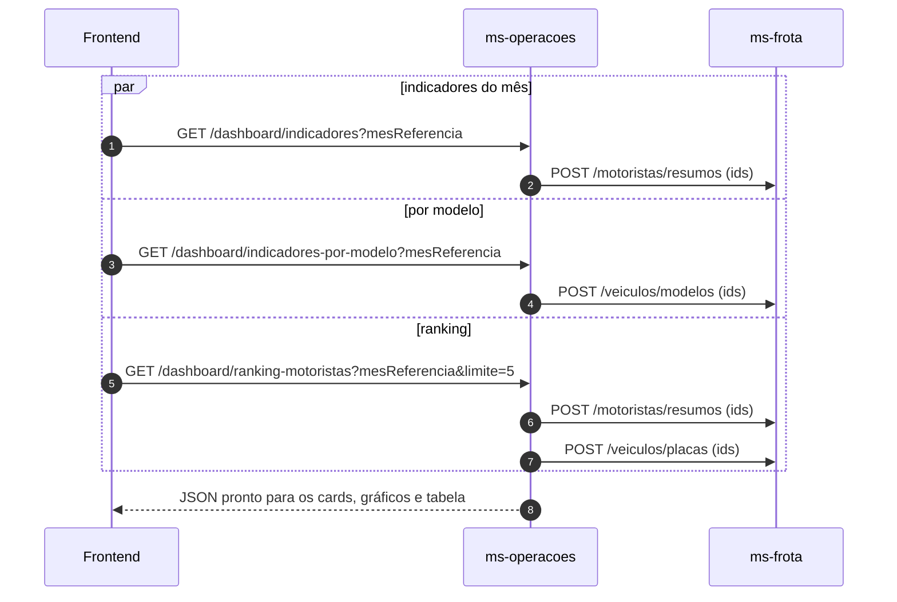
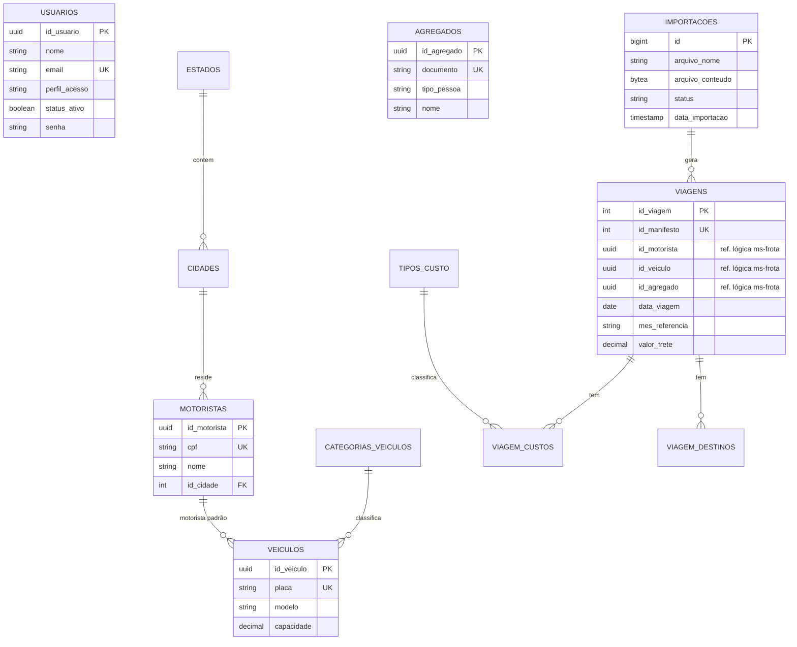

# Documento de Arquitetura

> **Status:** rascunho · **Atualizado:** 29/09/2026
> Complementa o estudo em [`docs/task/arquitetura-microservicos`](../task/arquitetura-microservicos/README.md), que registra como a divisão foi decidida.

## Sumário

1. [Visão geral](#1-visão-geral)
2. [Contexto do sistema](#2-contexto-do-sistema)
3. [Containers](#3-containers)
4. [Microsserviços](#4-microsserviços)
5. [Segurança](#5-segurança)
6. [Fluxos principais](#6-fluxos-principais)
7. [Dados](#7-dados)
8. [Tecnologias](#8-tecnologias)
9. [Execução e configuração](#9-execução-e-configuração)
10. [Decisões de arquitetura](#10-decisões-de-arquitetura)
11. [Pontos em aberto](#11-pontos-em-aberto)

---

## 1. Visão geral

O sistema centraliza o controle dos motoristas agregados da Newelog. Ele recebe a planilha de manifestos (CSV), grava as viagens e calcula indicadores de disponibilidade, utilização e rentabilidade por motorista e por modelo de veículo.

A arquitetura é de **microsserviços** atrás de um **API Gateway**:

- um frontend web (React);
- um gateway, que é o único ponto de entrada da API;
- três microsserviços, cada um dono de um domínio e das suas tabelas;
- um banco PostgreSQL (Supabase), hoje compartilhado entre os serviços.

## 2. Contexto do sistema

Nível 1 do [modelo C4](https://c4model.com/): quem usa o sistema e com o que ele se relaciona.



## 3. Containers

Nível 2 do C4: as partes que rodam separadamente e como elas conversam.



| Container | Responsabilidade | Tecnologia |
|---|---|---|
| Frontend | Telas do sistema | React 19, TypeScript, Vite, Chart.js |
| api-gateway | Único endereço público da API: roteia, valida o JWT, aplica CORS e informa o status dos serviços | Spring Cloud Gateway (WebMVC) |
| ms-usuarios | Login, emissão de JWT e cadastro de usuários | Spring Boot, Spring Security |
| ms-frota | Motoristas, veículos, agregados, cidades e estados | Spring Boot, Spring Data JPA |
| ms-operacoes | Importação do CSV, viagens e indicadores | Spring Boot, Spring Data JPA, Commons CSV |
| Banco | Persistência | PostgreSQL (Supabase) |

## 4. Microsserviços

**Regra que vale para todos:** cada tabela tem um dono. Nenhum outro serviço lê ou grava nela diretamente; o acesso é sempre pela API do dono.

### 4.1 api-gateway (`:8080`)

- Rotas declaradas em `application.yml`, por prefixo de caminho.
- `JwtAutenticacaoFilter`: valida o token e injeta `X-User-Name` e `X-User-Role`.
- `CorsConfig`: o CORS fica só aqui. Os serviços de trás não usam `@CrossOrigin`.
- `StatusController` (`GET /api/status`): consulta o `/actuator/health` de cada serviço.
- Não tem banco nem regra de negócio.

### 4.2 ms-usuarios (`:8081`)

| | |
|---|---|
| Tabelas | `usuarios` |
| Funções | login, geração de JWT, cadastro com senha em BCrypt |
| Perfis | `Operador`, `Gestor`, `Administrador` |

### 4.3 ms-frota (`:8082`)

| | |
|---|---|
| Tabelas | `motoristas`, `veiculos`, `agregados`, `categorias_veiculos`, `cidades`, `estados` |
| Funções | consulta por chave natural (CPF, placa, documento); upsert em lote; consultas em lote por id para o dashboard |

`cidades` e `estados` ficam aqui por serem dados de referência, não um domínio próprio (ver [ADR 0001](./decisoes/0001-microsservicos-por-dominio.md)).

### 4.4 ms-operacoes (`:8083`)

| | |
|---|---|
| Tabelas | `importacoes`, `viagens`, `viagem_custos`, `viagem_destinos`, `tipos_custo`, `controle_disponibilidade` |
| Funções | recebimento, validação e gravação do CSV de manifestos; consulta de viagens; indicadores e ranking |

Organização interna por camadas:

```
controller/   → endpoints REST (Importacao, Viagem, Dashboard)
service/
  importacao/ → parser do CSV, catálogo de campos, validação, gravação em lote
  indicadores/→ fórmulas puras (CalculoIndicadores) e agregação por mês/modelo
client/       → FrotaClient: chamadas HTTP ao ms-frota
repository/   → Spring Data JPA
models/       → entidades JPA
security/     → PerfilResolver (lê os headers injetados pelo gateway)
```

O ms-operacoes **não grava** motoristas, veículos nem agregados. Durante a importação, ele chama os endpoints `/lote` do ms-frota e recebe os ids de volta.

## 5. Segurança



| Mecanismo | Onde |
|---|---|
| Senha com hash BCrypt | ms-usuarios (`UsuarioService`) |
| JWT HMAC-256, emissor `ms-usuarios`, 2 h | emitido pelo ms-usuarios, validado pelo gateway |
| Chave do JWT fora do git | `application-dev.properties` (não versionado) ou variável `API_SECURITY_TOKEN_SECRET` |
| Remoção de headers forjados | gateway (`JwtAutenticacaoFilter`) |
| Autorização por perfil | gateway (`/api/status`) e serviços, via `X-User-Role` |
| Actuator limitado a `health` sem detalhes | todos os serviços |

> **Premissa:** os serviços confiam nos headers do gateway. Isso só é seguro se as portas 8081 a 8083 **não** estiverem expostas para fora da rede interna.

## 6. Fluxos principais

### 6.1 Importação de manifestos

A importação é feita em etapas (staging): o arquivo fica guardado e só vira viagem quando o usuário confirma (ver [ADR 0003](./decisoes/0003-importacao-em-etapas.md)).



**Validação.** O catálogo `CampoManifesto` é a fonte única das colunas esperadas: nome no CSV, tipo e nível (`OBRIGATORIO`, `IMPORTANTE`, `OPCIONAL`, `DERIVADO`). O parser e a tela de mapeamento usam essa mesma lista. Uma célula obrigatória inválida gera `ERRO` e bloqueia o arquivo; uma importante vazia gera `PENDENCIA`, que não bloqueia.

**Limpeza.** Um job `pg_cron` no banco (migration V6) apaga de hora em hora as importações abandonadas: `AGUARDANDO`, `VALIDADO` e `ERRO` após 24 h, e `EM_PROCESSAMENTO` após 6 h. Importações `CONCLUIDO` nunca são apagadas.

### 6.2 Dashboard



As chamadas ao ms-frota são **sempre em lote**: uma requisição para todos os ids, nunca uma por motorista.

## 7. Dados

### 7.1 Modelo



Tabelas por dono: `usuarios` pertence ao ms-usuarios; `motoristas`, `veiculos`, `agregados`, `cidades`, `estados` e `categorias_veiculos` ao ms-frota; as demais ao ms-operacoes.

### 7.2 Referências entre serviços

Não existe chave estrangeira entre tabelas de donos diferentes. `viagens.id_motorista`, `id_veiculo` e `id_agregado` guardam o UUID, e a consistência é garantida pela aplicação: os ids vêm da resposta do ms-frota. Isso prepara a separação futura dos bancos.

### 7.3 Versionamento

O schema é versionado com **Flyway** em [`db/migration`](../../db/migration), com Hibernate em `ddl-auto=validate`. Regras e estado atual estão em [`db/README.md`](../../db/README.md).

| Migration | Conteúdo |
|---|---|
| V2 | tabela `agregados` e `viagens.id_agregado` |
| V3 | campos do manifesto em `viagens`, `mes_referencia`, seed de `tipos_custo` |
| V4 | `agregados.tipo_pessoa` para varchar |
| V5 | `arquivo_importacao` renomeada para `importacoes`, conteúdo em `bytea` e status do fluxo em etapas |
| V6 | job `pg_cron` de limpeza de importações |

## 8. Tecnologias

| Camada | Tecnologia |
|---|---|
| Frontend | React 19, TypeScript 6, Vite 8, React Router 7, Axios, Chart.js 4, lucide-react |
| Backend | Java 17, Spring Boot 4.1, Spring Cloud 2025.1 (Gateway WebMVC), Spring Data JPA, Spring Security |
| Autenticação | JWT (auth0 `java-jwt`), BCrypt |
| CSV | Apache Commons CSV |
| Banco | PostgreSQL (Supabase), Flyway, pg_cron |
| Observabilidade | Spring Boot Actuator (`/actuator/health`) |
| Testes | JUnit, Spring Boot Test, H2 |

## 9. Execução e configuração

### 9.1 Portas

| Serviço | Porta |
|---|---|
| Frontend (Vite) | 5173 (ou 5174 se estiver ocupada) |
| api-gateway | 8080 |
| ms-usuarios | 8081 |
| ms-frota | 8082 |
| ms-operacoes | 8083 |

### 9.2 Subindo o ambiente

`backend/subir-tudo.cmd` confere o JDK, as credenciais locais e as portas livres, e depois sobe os quatro serviços, cada um na sua janela. `backend/parar-tudo.cmd` encerra todos. O passo a passo completo está no [README principal](../../README.md#como-rodar-o-projeto).

### 9.3 Variáveis de ambiente

| Variável | Usada por | Descrição |
|---|---|---|
| `SUPABASE_DB_URL`, `SUPABASE_DB_USER`, `SUPABASE_DB_PASSWORD` | microsserviços | conexão com o banco |
| `API_SECURITY_TOKEN_SECRET` | gateway, ms-usuarios | chave do JWT (tem que ser a mesma nos dois) |
| `MS_USUARIOS_URL`, `MS_FROTA_URL`, `MS_OPERACOES_URL` | gateway | endereço dos serviços |
| `FROTA_BASE_URL` | ms-operacoes | endereço do ms-frota |
| `CORS_ORIGEM` | gateway | origem permitida do frontend |
| `SPRING_PROFILES_ACTIVE` | todos | perfil ativo (padrão `dev`) |
| `VITE_API_URL` | frontend | URL base da API |

Os segredos ficam em `application-dev.properties`, que não é versionado. Cada serviço tem um `application-dev.properties.example` como modelo.

## 10. Decisões de arquitetura

As decisões ficam registradas como ADRs (*Architecture Decision Records*) em [`decisoes/`](./decisoes/):

| ADR | Decisão |
|---|---|
| [0001](./decisoes/0001-microsservicos-por-dominio.md) | Microsserviços divididos por domínio, com dono único por tabela |
| [0002](./decisoes/0002-api-gateway-com-autenticacao.md) | API Gateway como entrada única, validando o JWT |
| [0003](./decisoes/0003-importacao-em-etapas.md) | Importação de manifestos em etapas (staging) |

Para registrar uma nova decisão, copie um ADR existente, use o próximo número e preencha Contexto, Decisão e Consequências.

## 11. Pontos em aberto

| Item | Situação |
|---|---|
| Banco compartilhado | Os serviços ainda usam o mesmo Supabase. A separação por serviço está proposta em [`docs/task/docker-ambiente-local`](../task/docker-ambiente-local/README.md) |
| Flyway | Desligado em todos os serviços e `V1__baseline.sql` ainda não foi escrito (ver [`db/README.md`](../../db/README.md)) |
| `POST /api/usuarios` público | Aberto para criar o primeiro Administrador; deve passar a exigir perfil `Administrador` |
| Autorização por perfil nos serviços | O `PerfilResolver` existe, mas só o `/api/status` restringe por perfil hoje |
| Documentação automática da API | Avaliar springdoc-openapi (Swagger UI) no gateway |
